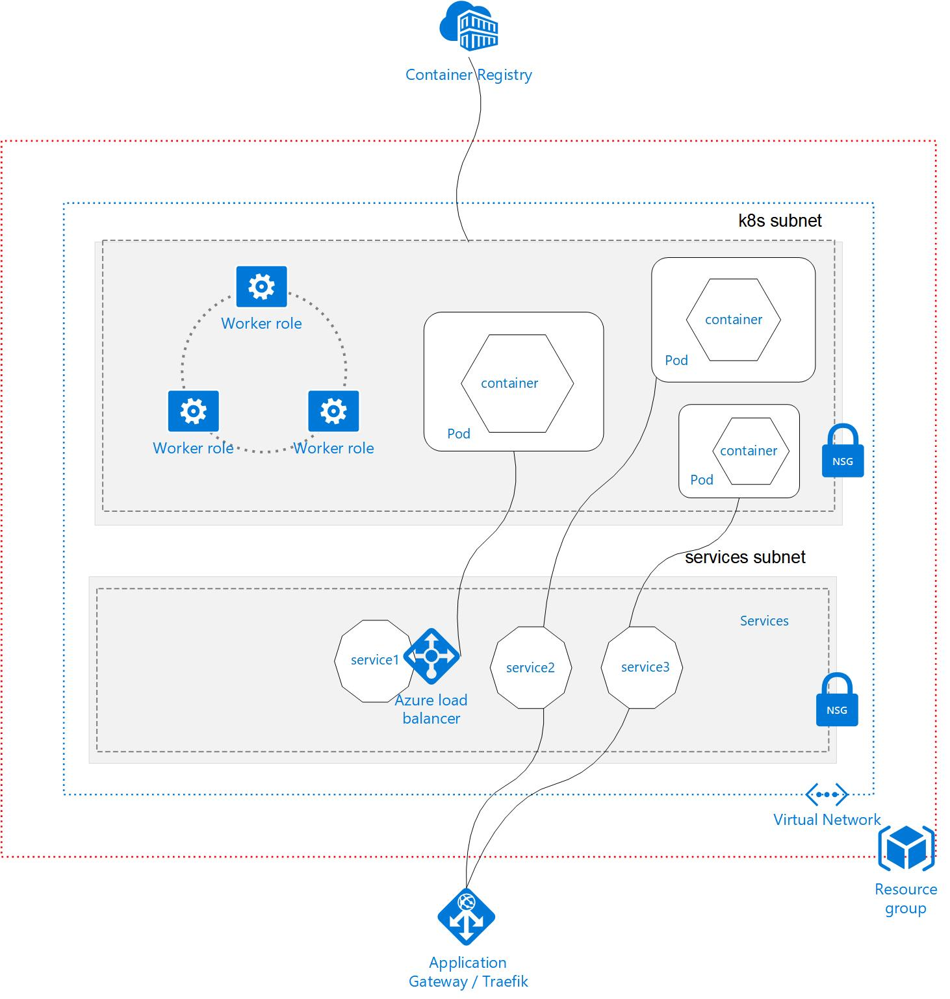

# Azure Kubernetes Service (AKS) with Advanced Networking

## Objectives/ Challenges

The objective of this hands-on lab is not to complete all the steps, but to understand what you are doing and take away the knowledge which could be useful in your environmet. Here's what we'll try to achieve:

- Run AKS cluster with VNet integration
- Use ARM templates for the setup
- Setup ACR & integrate it with AKS
- Push & pull container images from ACR
- Expose services on internal & public facing network
- Extend AKS cluster with ACI
- Option to setup CI & CD pipeline using Azure DevOps
- Use persistent storage and state for the DB application
- Explore Monitoring/ Application Insights

At the end of lab you'll have a vnet with 2 subnets, Azure Container Registery, AKS cluster, Public & Private LoadBalancers, 3 applications and a DB running. Here's how it'll look like:

---
## Hands-on lab
[Before you start](start.md) \
[Configure your environment](envconfigure.md) \
[Setup Azure Container Registry](acr.md) \
[Create a Kubernetes cluster in Azure](aks.md) \
[Prepare container images](prepareimages.md) \
[Allow AKS to access ACR images](akstoacr.md) \
[Prepare AKS cluster for HELM deployments](helm.md) \
[Private and Public Ingress](ingress.md) \
[Deploy apps to AKS](deployapps.md) \
[Extend AKS](aci.md) \
[Persistent storage and state](storage.md) \
[Upgrading and Scaling AKS](upgrade.md) \
[Logging & Application Insights](monitor.md)
 
 
 
 

---
Let's get our hands dirty [Before you start](start.md)