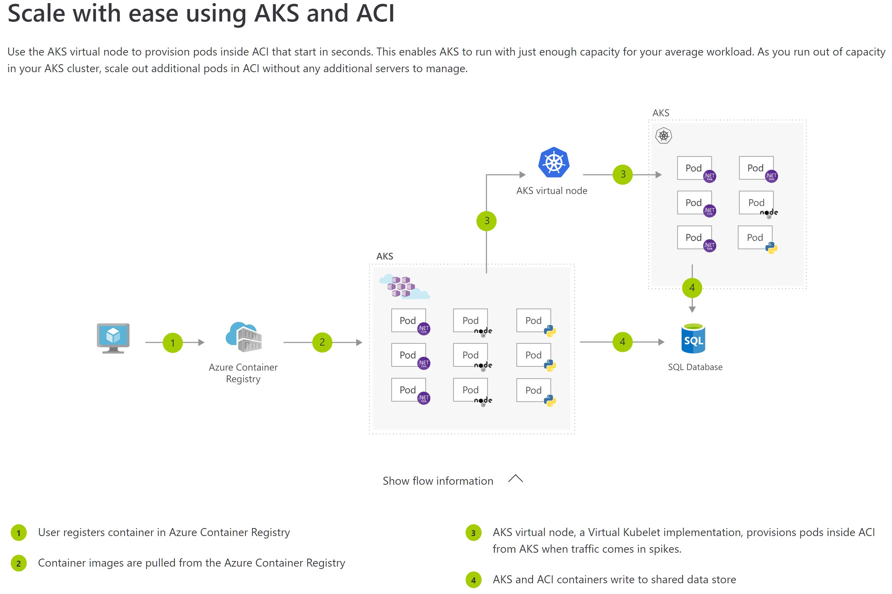

## Extend AKS with ACI (Azure Container Images)

> !! Bonus - Extend AKS cluster workloads to Azure Container Instances (ACI), without adding any nodes to your cluster !!\
More info here: [Use Virtual Kubelet with Azure Kubernetes Service (AKS)](https://docs.microsoft.com/en-us/azure/aks/virtual-kubelet)

Architecture example here:

 
 
 
 

---
Continue to [Persistent storage and state](storage.md) \
Back to [Deploy apps to AKS](deployapps.md) or to [Home](README.md)