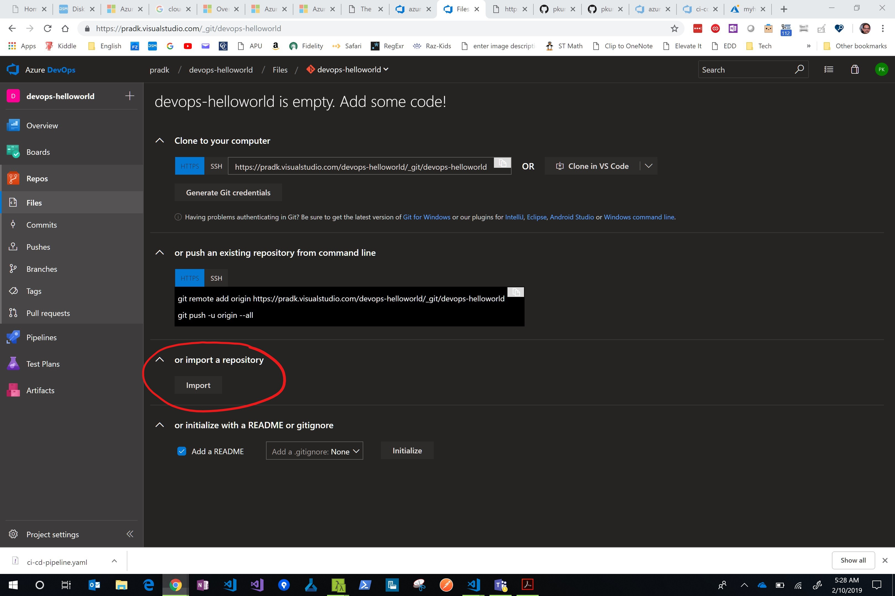
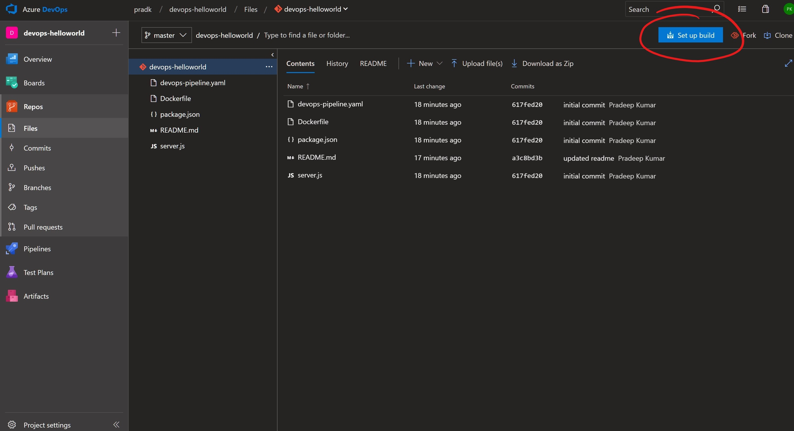
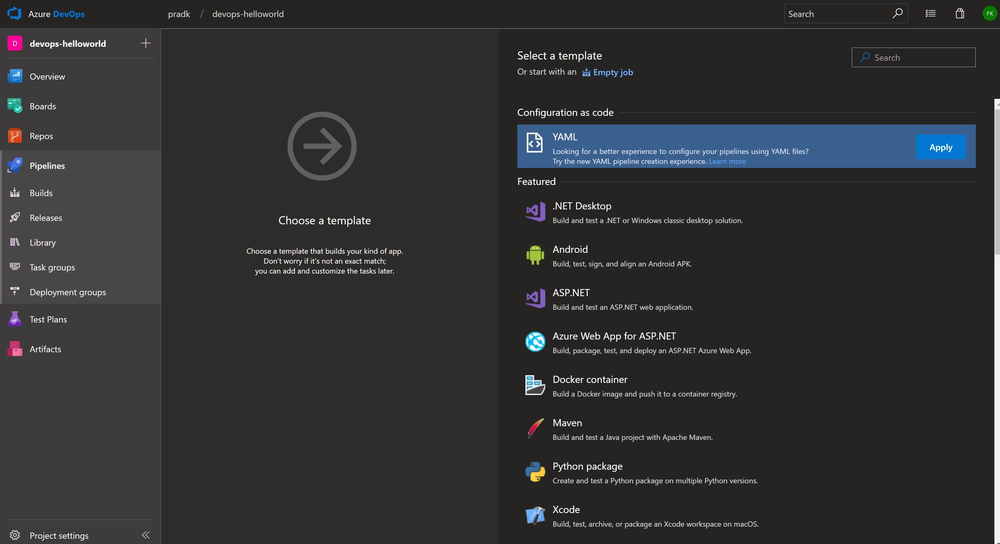
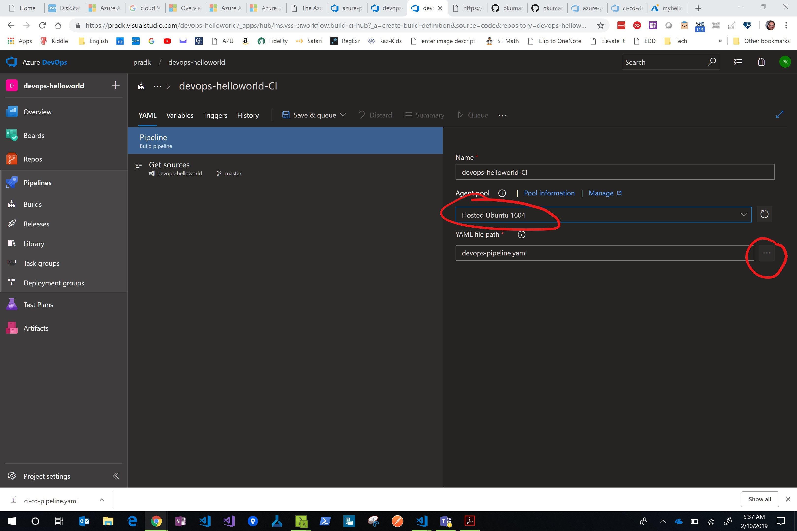

# Continous Integration & Continous Delivery with Azure DevOps

## Using Azure DevOps to create container images & pushing such images to Azure container registry
- Visit https://dev.azure.com and sign-in with your Azure subscription credentials
- If this is a new Azure DevOps account, a quick wizard will guide you to create a new organization
- Create a new private project, and give it a name.

- Click on Repos then import the code of the captureorder service from the public GitHub repository located at https://github.com/pkumar26/azure-devops.git
 
- Build pipeline for the application Docker container is included in the repo.

- Choose YAML as the pipeline template

- Browse to and select the devops-pipelines.yml file. You may also change the agent to be Hosted Ubuntu

- Define variables in your build pipeline in the web UI
>
        dockerId: The admin user name/Service Principal ID for the Azure Container Registry.
        acrName: The Azure Container Registry name.
        dockerPassword: The admin password/Service Principal password for Azure Container Registry.

- Run the build pipeline and verify that it works
