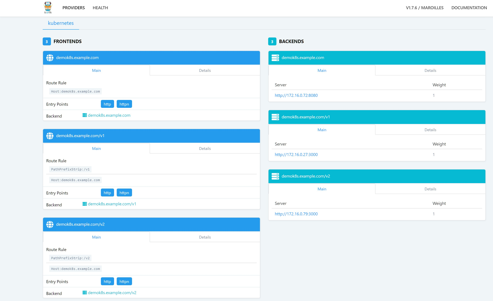

## Private and Public Ingress

>There are multiple ways to expose services running inside AKS e.g. through Azure ALB, LB, Nginx Ingress controller, Traefik etc.
For this demo you'll be exposing internal application through Azure Internal LB & Public facing application through Traefik, which will use Azure LB.

**Install Traefik**
>If you have a public domain to work with, replace example domain name below. If not, you need to add example domain to hosts file as shown below:

    helm install --set dashboard.enabled=true,dashboard.domain=demok8s.example.com stable/traefik

>Wait untill LoadBalancer has IP allocated to it.

    kubectl get services

    NAME                                TYPE           CLUSTER-IP    EXTERNAL-IP   PORT(S)                      AGE
    kubernetes                          ClusterIP      10.0.0.1      <none>        443/TCP                      4h
    virulent-dragon-traefik             LoadBalancer   10.0.75.182   <pending>     80:32426/TCP,443:30632/TCP   18s
    virulent-dragon-traefik-dashboard   ClusterIP      10.0.33.244   <none>        80/TCP                       18s
>
    kubectl get services

    NAME                                TYPE           CLUSTER-IP    EXTERNAL-IP   PORT(S)                      AGE
    kubernetes                          ClusterIP      10.0.0.1      <none>        443/TCP                      4h
    virulent-dragon-traefik             LoadBalancer   10.0.75.182   13.14.15.16  80:32426/TCP,443:30632/TCP   18s
    virulent-dragon-traefik-dashboard   ClusterIP      10.0.33.244   <none>        80/TCP                       18s

>Note down the External-IP of Public Load Balancer.\
If you have a public domain, you may set up an A record to point to this IP e.g. demok8s.example.com. Accessing this will show you the dashboard of traefik. If not, please edit your local hosts file and add example domain pointing to LoadBalancer External IP:

    On Windows: notepad c:\windows\system32\drivers\etc\hosts
    On Linux: vim /etc/hosts

    <LoadBalancer IP> demok8s.example.com  # Replace with your LoadBalancer EXTERNAL-IP, e.g. 13.14.15.16	demok8s.example.com

 
 
 
 

---
Continue to [Deploy apps to AKS](deployapps.md) \
Back to [Prepare AKS cluster for HELM deployments](helm.md) or to [Home](README.md)