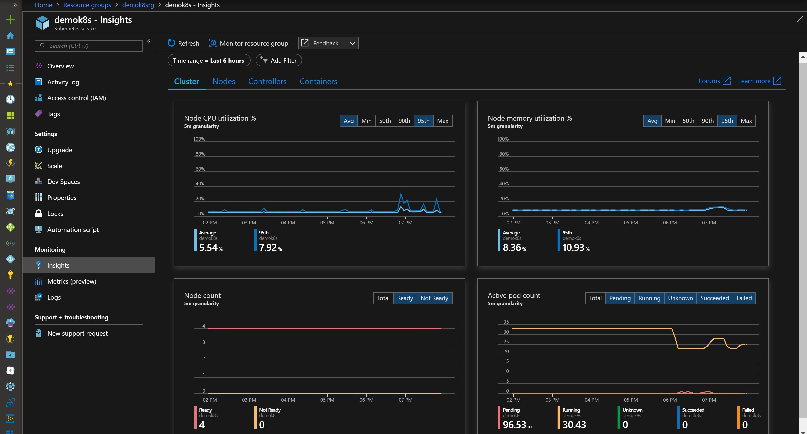
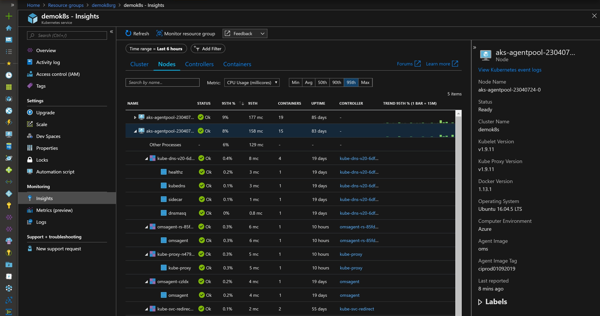
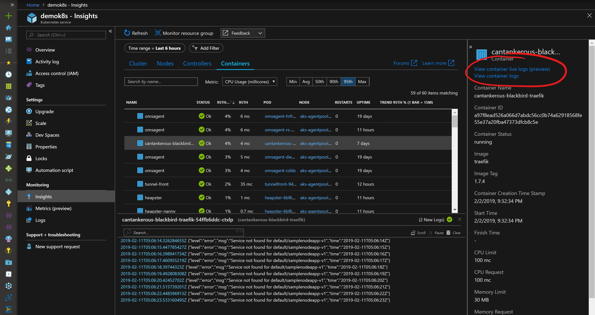
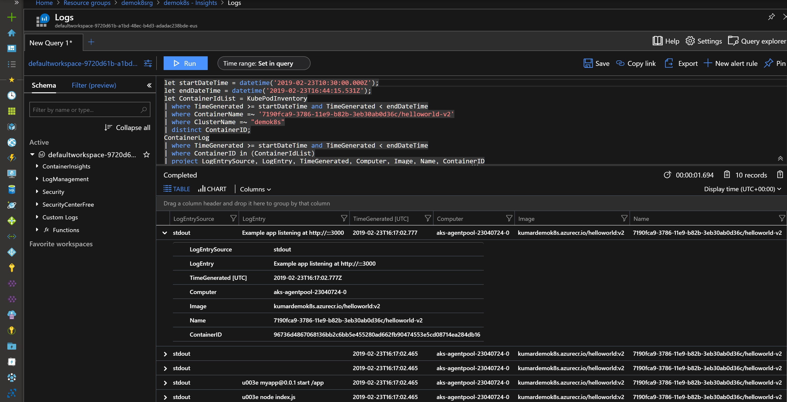
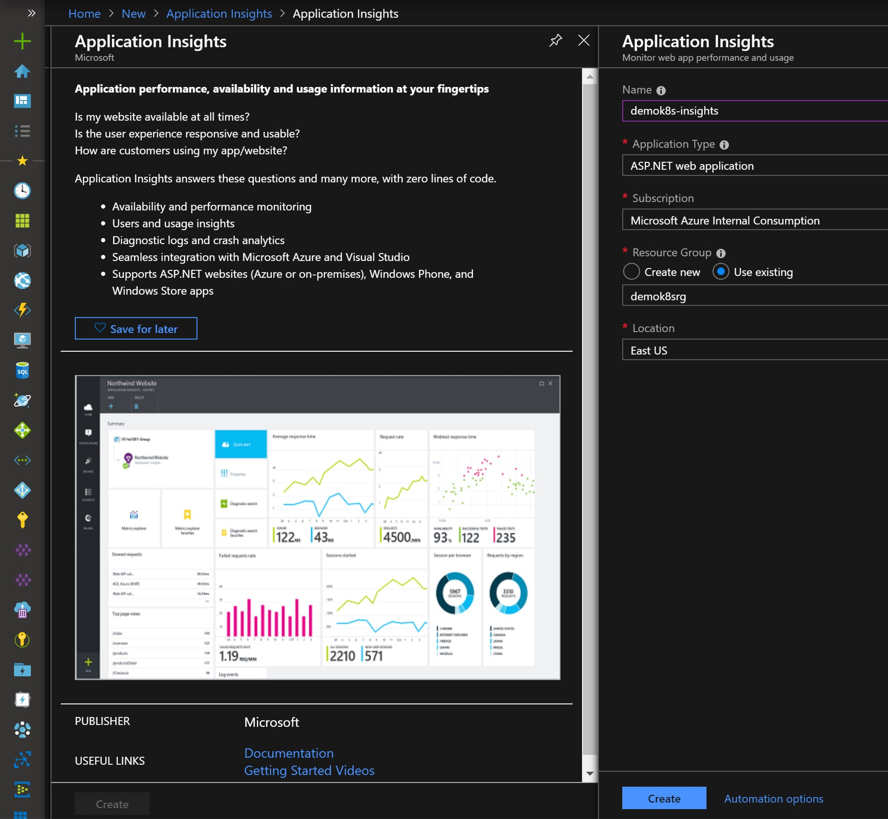
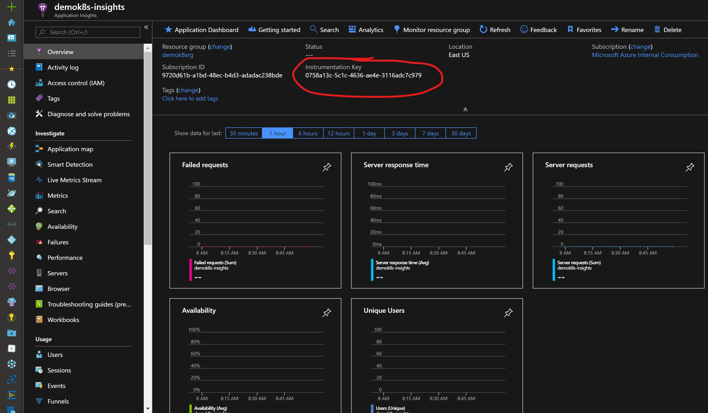
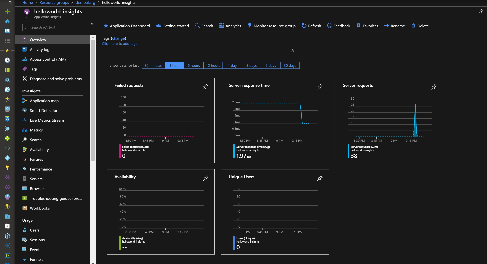
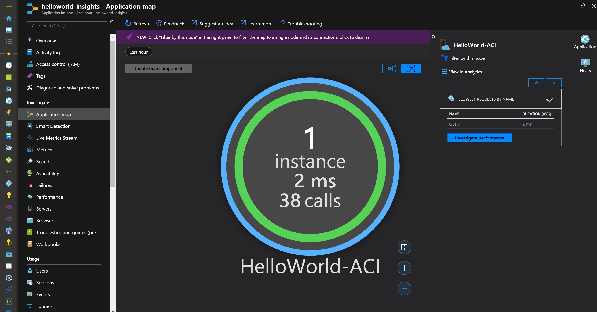

## Monitoring - Logs & Application Insights

**Setup Azure Monitor for Containers**

- Unless you changed value of "enableOmsAgent" in template, monitoring is already enabled on your AKS cluster. If you disabled it, it can be added as follows:
>
    kubectl get ds omsagent --namespace=kube-system

**Gaining Insights into AKS Cluster Performance**

Browse to your AKS cluster on the Azure portal and click on Insights under Monitoring. Enable Azure container monitoring:

 Check cluster, nodes or container info. Click on the Containers tab and pick a container to view its live logs and debug what is going on...

**Viewing container logs**

Select any container and in right blade click view container logs

**Enable APM to get insights into your application**

- Create Application Insights resource with appropriate application type. Node.js in case of helloworld example application
- Once created, go to the resource and copy Instrumentation key

To get insights into any application, you need to add sdk to your container. Here are some more links with useful info..

- [Application Insight SDKs](https://github.com/Microsoft/ApplicationInsights-Home)
- [What is Application Insights?](https://docs.microsoft.com/en-us/azure/azure-monitor/app/app-insights-overview)

**Let's add node.js sdk to our helloworld example application**

> !! Bonus - Create a container image with app insight SDK & push it to your repository. Then deploy app on AKS using that container !!

>
>Hints:
>- [Use ACR build to create and push image to your registry](https://docs.azure.cn/zh-cn/cli/acr?view=azure-cli-latest#az-acr-build) \
    az acr build -r \<yourACRRegistry> https://github.com/pkumar26/appinsights-demo.git -f Dockerfile -t appinsightsdemo
>- modify appinsights-demo.yaml with your parameter values
>- kubectl apply -f appinsights-demo.yaml

>
>Send some traffic to your container at http://demok8s.example.com/appinsights-demo

Explore Application Insight dashboard, metrics & application map sections as your application will start sending data.

 
 
 
 

---
Back to [Upgrading and Scaling AKS](upgrade.md) or to [Home](README.md)